# Homework and Chinese Note for CS224N

- You can check notes in [Appendix A](#a)
  - [Lecture 1  wordvecs1](##-lecture-1-wordvecs1)
  - [Assignment 1](##-assignment-1)
  - [Lecture 4 backprop](##-lecture-4-backprop)
  - [Assignment 2](##-assignment-2)
  - [Assignment 3](##-assignment-3)
  - [Assignment 4](##-assignment-4)
  - [ Lecture 8 How to do NLP Research](##-lecture-8-final-projects-practical-tips)
    1. [寻找研究课题](####-1.-寻找研究课题)
    2. [NLP 令人兴奋的领域](#####-2.-NLP-2021-令人兴奋的领域)
    3. [查找数据集和任务](####-3.查找数据集和任务)
    4. [Research habits/tricks/pipeline](####-4.-Research-habits/tricks/pipeline)
       - [4.1 寻找研究课题](#####-4.1-寻找研究课题：)
       - [4.2  动手实验尝试](#####-4.2-动手实验尝试)
       - [4.3 简化泛化模型](#####-4.3-简化泛化模型：)
       - [4.4 和导师交流 进行文献系统阅读](#####-4.4-和导师交流 进行文献系统阅读)
       - [4.5 参加研讨会 演讲](#####-4.5-参加研讨会-演讲)
         - [4.5.1 引言：](######-4.5.1-引言：)
         - [4.5.2 内容：](######-4.5.2-内容：)
         - [4.5.3 结论：](######-4.5.3-结论：)
         - [4.5.4 结束：](######-4.5.4-结束：)
       - [4.6 规划论文:](#####-4.6-规划论文：)
       - [4.7 论文结构](#####-4.7-论文结构)
       - [4.8 何时停止](#####-4.8-何时停止)
    5. [项目建议](####-5.-项目建议)
       - [5.1 定义你的目标](#####-5.1-定义你的目标)
       - [5.2 处理数据](#####-5.2-处理数据)
       - [5.3 数据hygiene](#####-5.3-数据hygiene)
       - [5.4 建立强大的基线](#####-5.4-建立强大的基线)
       - [5.5 训练和调试神经模型](#####-5.5-训练和调试神经模型)
       - [5.6 评价](#####-5.6-评价)


- Homework codes:
  - [Assignment1](./a1)
  - [Assignment2](./a2)
  - [Assignment3](./a3)
  - [Assignment4](./a4)
  - [Assignment5](./a5)


# A

## Lecture 1  wordvecs1

### Slides:

#### 1.一些想法：

- 就像人是由周围的社会关系决定的，词是由上下文决定的。(PS：如果用马原来指导 这不是显然的嘛：） 把词当作人 人是一切社会关系的总和 词是一切上下文关系的总和 )

- 一个词的表达有多了解他所处的周围坏境(及他的社会关系) 他就有多了解他自己 就有多接近他本身的意思。

#### 2. 关于点积的疑惑点：

[Mark] 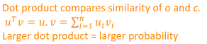 

为什么 点积越大与相似呢 比如说A,B 只有在A+B=C(定值) 时 A=B时点积最大 但是在这里 ui vi的和并不是一定的呀

为什么不直接用两个向量的差的向量的2-范数来表示？ 而且还是恒正的。 是因为计算量大嘛？

也许可以从向量内积的集合意义上入手理解：

> 内积的几何意义 
>
> 点乘的几何意义是可以用来表征或计算两个向量之间的夹角，以及在b向量在a向量方向上的投影。
>
> 那么归一化后 就是在超球上的两个向量的夹角的cos值 该值越大 夹角越小 相似度越大
>
> Cosine Distance：  1 - Cosine Similarity   余弦距离


#### 3.softmax理解摘要:

给定一组数据 或者可以看作一个向量  用softmax可以给出他们的一个概率分布：

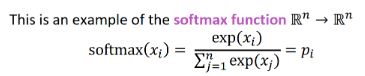   

max:是因为最大的那个数据的概率(相比与直接平均)

soft:只因为仍然给那些小的数据一定的概率

这个挺漂亮的 但是最大的症结是为什么 ui*vi 越大 两个向量越相似。[**已解决(见2.)**]


### Suggested Readings:

#### 1.softax函数的一个性质：

对于softmax函数 如果所有的xi进行同样程度的平移(即减去一个向量) 函数输出不变。也就是说，它有一组“冗余”的参数(即可以将其中一个xi变为0)。 

#### 2. softmax 与 logistic regression:

softmax函数当其K=2时 依据1进行变形就会变为logistic regression:
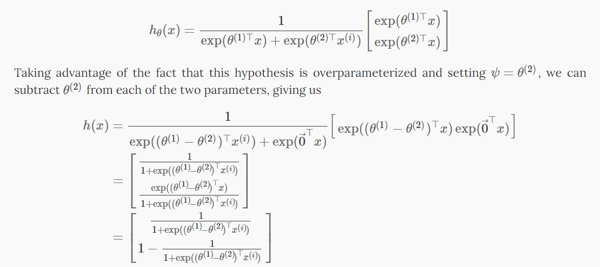

#### 3. 解决模型过大 

运行梯度下降慢 过度拟合的问题 有两种既加快训练速度又提升词向量质量的办法：

- 对频繁词进行二次采样以减少训练示例的数量
- 使用“负采样”的技术修改优化目标，每个训练样本仅更新模型权重的一小部分。

#### 4. 二次采样：

word2vec C 代码实现了一个公式，用于计算在词汇表中保留给定单词的概率：

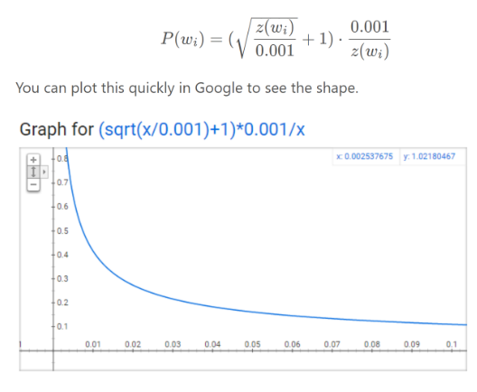    

z(wi) 是语料库中属于该词的总词的概率分数

- 当 z(wi)<=0.0026z时，P(wi)=1.0P(wi)=1.0（被保留的机会为 100%）这意味着只有占总单词 0.26% 以上的单词才会被子采样。
- 当 z(wi)=0.00746时，P(wi)=0.5P(wi)=0.5（50% 的机会被保留）。
- 当 z(wi)=1.0，P(wi)=0.033P(wi)=0.033（3.3% 的机会被保留）。 也就是说，如果语料库完全由wiwi这个词组成，荒谬。

> [论文中定义的这个函数与 C 代码中实现的略有不同，但认为 C 实现是更权威的版本]

#### 5.负采样:

- 思路：例如，在词对（“fox”、“quick”）上训练网络时，网络的“标签”或“正确输出”是一个单热向量。也就是说，对应于“quick”的输出神经元输出一个 1，而所有其他数千个输出神经元输出一个 0。 使用负采样，将随机选择少量“负”词（假设为 5 个）来更新权重。 （因此，只更新"正"词（“quick”）的权重，加上想要输出 0 的其他 5 个词的权重。总共有 6 个输出神经元，总共 1,800 个权重值。只是输出层中 3M 权重的 0.06%！

- 选择负样本： “负样本”（即我们将训练输出 0 的 5 个输出词）使用“一元分布”选择，其中更频繁的词更有可能被选为负样本。即利用单词出现的概率作为选择概率。作者在他们的论文中尝试了对该等式的多种变体，其中表现最好的是将字数提高到 3/4 次方：

  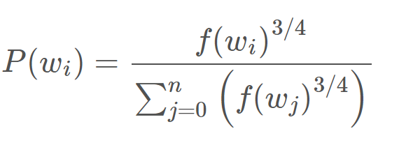

  该等式倾向于增加出现频率较低的词的概率并降低出现频率较高的词的概率

> [论文称，选择 5-20 个单词对于较小的数据集效果很好，而对于大型数据集，只需选择 2-5 个单词即可。]

> [在隐藏层中，仅更新输入词的权重（无论是否使用负采样都是如此）]


## Assignment 1: 

#### 1.奇异值分解(SVD):

[https://zhuanlan.zhihu.com/p/29846048]

[https://davetang.org/file/Singular_Value_Decomposition_Tutorial.pdf]

[lectures [7](https://web.stanford.edu/class/cs168/l/l7.pdf), [8](http://theory.stanford.edu/~tim/s15/l/l8.pdf), and [9](https://web.stanford.edu/class/cs168/l/l9.pdf) of CS168 课程笔记提供了对压缩通用算法(PCA/SVD)的高级处理]

SVD是对数据进行有效特征整理的过程。首先，对于一个m×n矩阵A，可以理解为其有m个数据，n个特征，（想象成一个n个特征组成的坐标系中的m个点），然而一般情况下，这n个特征并不是正交的，也就是说这n个特征并不能归纳这个数据集的特征。

SVD的作用就相当于是一个坐标系变换的过程，从一个不标准的n维坐标系，转换为一个标准的k维坐标系，并且使这个数据集中的点，到这个新坐标系的欧式距离为最小值（也就是这些点在这个新坐标系中的投影方差最大化），其实就是一个最小二乘的过程。

进一步，如何使数据在新坐标系中的投影最大化呢，就需要让这个新坐标系中的基尽可能的不相关，可以用协方差来衡量这种相关性。当对这个协方差矩阵进行特征分解之后，可以得到奇异值和右奇异矩阵，而右奇异矩阵则是一个新的坐标系，奇异值则对应这个新坐标系中每个基对于整体数据的影响大小，这时便可以提取奇异值最大的k个基作为新的坐标。

#### 2.外积、内积和叉积：

英语语境里，外积(outer)和叉积(cross)是不一样的，外积是列向量乘行向量（内积相反），叉积是叉乘的结果。

#### 3.matplotlib.pyplot.imshow 的一个小问题：

matplotlib.pyplot.imshow 的一个小问题是它可能会产生奇怪的结果(如果呈现的数据不是 uint8) 为了解决这个问题，应该在显示之前将图像显式转换为 uint8。

```python
plt.imshow(np.uint8(img_tinted))
plt.show()
```

#### 4. 高效SVD：

numpy、scipy 和 scikit-learn（sklearn）都提供了一些 SVD 的实现，但只有 scipy 和 sklearn 提供了 Truncated SVD 的实现，只有 sklearn 提供了计算大规模 Truncated SVD 的高效随机算法。所以应该使用 sklearn.decomposition.TruncatedSVD。

#### 5. SVD实现的小细节：

SVD 存在“符号不确定性”的问题，这意味着组件的符号和变换的输出取决于算法和随机状态。要解决此问题，应将此类的实例与数据拟合一次，然后保留该实例以进行转换。

> https://scikit-learn.org/stable/modules/generated/sklearn.decomposition.TruncatedSVD.html

```python
SVD=TruncatedSVD(n_components=k, n_iter=n_iters, random_state=42)
    M_reduced=SVD.fit_transform(M)
```

#### 6. numpy broadcasting :

> [Computation on Arrays: Broadcasting by Jake VanderPlas](https://jakevdp.github.io/PythonDataScienceHandbook/02.05-computation-on-arrays-broadcasting.html).

#### 7. 绘制图的参考 可以参考matplotlib库 简直应有尽有 ：

> [the Matplotlib gallery](https://matplotlib.org/gallery/index.html)

#### 8. Word2Vec使用小细节：

- 没法用gensim.downloader.load() 改成本地下载

  ```python
  from gensim import models
  
  wv_from_bin = models.KeyedVectors.load_word2vec_format(
      '/home/wangxidong/gensim-data/word2vec-google-news-300/GoogleNews-vectors-negative300.bin', binary=True)
  
  -vocab = list(wv_from_bin.vocab.keys())
  -print("Loaded vocab size %i" % len(vocab))
  ```

- 但上述方法的倒数第二行在gensim更新为4.0.0即以上后无法使用 

  > 参考https://github.com/RaRe-Technologies/gensim/wiki/Migrating-from-Gensim-3.x-to-4

  使用如下方法代替:

  ```python
   vocab = list(wv_from_bin.index_to_key)
  ```

#### 9. 查conda库：

> https://anaconda.org/


## Lecture 2 wordvecs2

### Slides:

#### 1. entropy:

- 计算事件的信息:

  信息论背后的基本直觉是，了解不太可能发生的事件比了解可能发生的事件提供更多信息。 

  > information(x) = h(x) = -log( p(x) )  log以2为底  所以衡量信息信息度量的单位是比特

  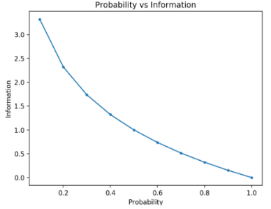      

- 计算随机变量的熵：

  熵 表示或传输 从随机变量的概率分布中 提取事件 所需的平均比特数

  > H(X) = -sum(each k in K p(k) * log(p(k)))

  最低熵是针对具有概率为 1.0（确定性）的单个事件的随机变量计算的。 随机变量的最大熵是所有事件的可能性相等。

  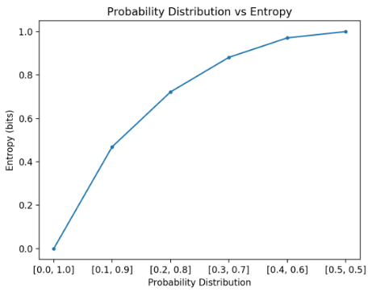   

  > 注意，在计算熵时，必须为概率添加一个很小的值，以避免计算零值的对数，这会导致无穷大而不是数字。

#### 2. cross entropy：

交叉熵是信息论领域的一种度量，建立在熵的基础上，是对给定随机变量或事件集的两个概率分布之间差异的度量。

**交叉熵是当使用模型 q 时，对来自分布为 p 的源的数据进行编码所需的平均位数**

- 两个概率分布之间的交叉熵，例如来自 P 的 Q，可以正式表示为：

  > H(P, Q) = – sum x in X P(x) * log(Q(x))

  其中 P 可能是目标分布，Q 是目标分布的近似值。

  其中 P(x) 是事件 x 在 P 中的概率，Q(x) 是事件 x 在 Q 中的概率，log 是以 2 为底的对数，这意味着结果以位为单位。

  [如果改为使用 base-e 或自然对数，则结果的单位将称为 nats]

  如果两个概率分布相同，结果将是一个以比特为单位测量的正数，并且将等于分布的熵。


### Suggested Readings:


## Python review session:

### Slides:

#### 1. python:

python-review.ipynb

https://www.w3schools.com/python/

#### 2. numpy:

https://cs231n.github.io/python-numpy-tutorial/

https://numpy.org/doc/stable/user/quickstart.html

#### 3. MATPLOTLIB:

https://matplotlib.org/stable/gallery/index.html


## Lecture 3  neural nets

### Slides:

#### 1. 一些基本知识

参见课件


## Lecture 4 backprop

### Slides:

#### 1.矩阵运算技巧：

训练尽量vectorized 而不是 for 循环

#### 2. 非线性函数：

为了构建一个前馈深度网络，应该尝试的第一件事是 ReLU——由于良好的梯度回流，它可以快速训练并且表现良好

#### 3. [**Mark**]  参数初始化：

-  **通常必须将权重初始化为小的随机值  避免产生对称性**

-  Xavier 初始化的方差与扇入 nin（前一层大小）和扇出 nout（下一层大小）成反比：

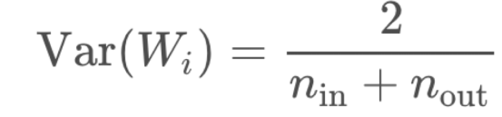

#### 4. 最优化：

对于复杂的网络和情况，通常使用一系列更复杂的“自适应”优化器中的一个会做得更好，这些优化器通过累积梯度来缩放参数调整。

- Adagrad

  AdaGrad 算法，如下图所示，独立地适应所有模型参数的学习率，缩放每个参数反比于其所有梯度历史平方值总和的平方根 (Duchi et al., 2011)。具有损失最大偏导的参数相应地有一个快速下降的学习率，而具有小偏导的参数在学习率上有相对较小的下降。净效果是在参数空间中更为平缓的倾斜方向会取得更大的进步。在凸优化背景中， AdaGrad 算法具有一些令人满意的理论性质。然而，经验上已经发现，对于训练深度神经网络模型而言， 从训练开始时积累梯度平方会导致有效学习率过早和过量的减小。 AdaGrad 在某些深度学习模型上效果不错，但不是全部。

  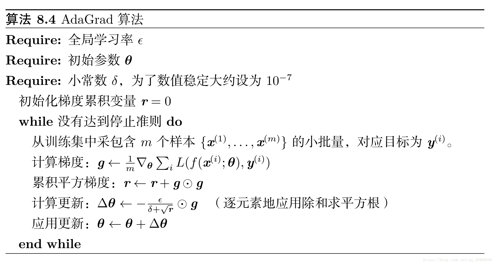  

- RMSprop

  RMSProp 算法 (Hinton, 2012) 修改 AdaGrad 以在非凸设定下效果更好，改变梯度积累为指数加权的移动平均。 AdaGrad 旨在应用于凸问题时快速收敛。当应用于非凸函数训练神经网络时，学习轨迹可能穿过了很多不同的结构，最终到达一个局部是凸碗的区域。 AdaGrad 根据平方梯度的整个历史收缩学习率，可能使得学习率在达到这样的凸结构前就变得太小了。 RMSProp 使用指数衰减平均以丢弃遥远过去的历史，使其能够在找到凸碗状结构后快速收敛，它就像一个初始化于该碗状结构的 AdaGrad 算法实例。RMSProp 的标准形式如算法 8.5 所示，结合 Nesterov 动量的形式如算法 8.6 所示。相比于 AdaGrad，使用移动平均引入了一个新的超参数ρ，用来控制移动平均的长度范围。经验上， RMSProp 已被证明是一种有效且实用的深度神经网络优化算法。目前它是深度学习从业者经常采用的优化方法之一。

  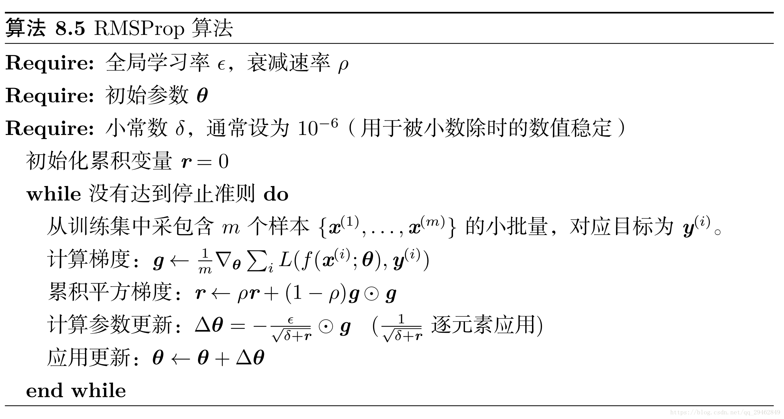  

  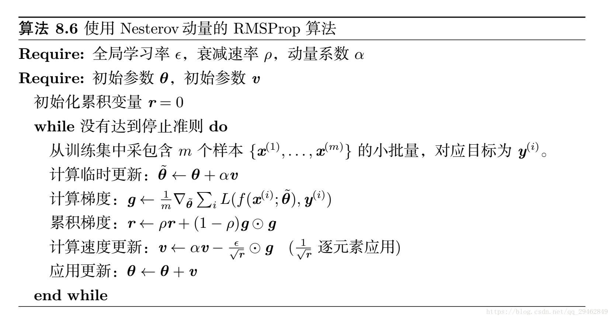 

- Adam [在许多情况下，相当好的、安全的]

  Adam (Kingma and Ba, 2014) 是另一种学习率自适应的优化算法，如算法 8.7 所示。 “Adam’’ 这个名字派生自短语 “adaptive moments’’。早期算法背景下，它也许最好被看作结合 RMSProp 和具有一些重要区别的动量的变种。首先，在 Adam 中，动量直接并入了梯度一阶矩（指数加权）的估计。将动量加入 RMSProp 最直观的方法是将动量应用于缩放后的梯度。结合缩放的动量使用没有明确的理论动机。其次， Adam 包括偏置修正，修正从原点初始化的一阶矩（动量项）和（非中心的）二阶矩的估计（算法 8.7 ）。 RMSProp 也采用了（非中心的）二阶矩估计，然而缺失了修正因子。因此，不像 Adam，RMSProp 二阶矩估计可能在训练初期有很高的偏置。Adam 通常被认为对超参数的选择相当鲁棒，尽管学习率有时需要从建议的默认修改。

  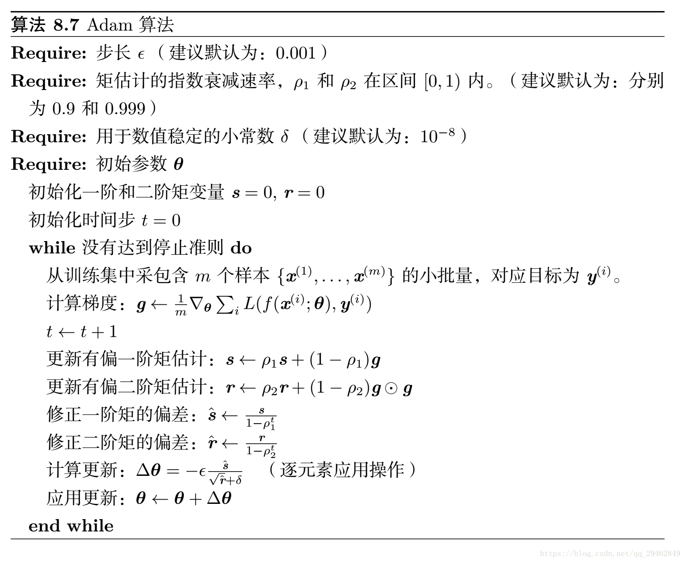 

- SparseAdam

- …  

#### 5. 学习率

通常可以通过在训练时降低学习率来获得更好的结果

- 手动：每 k 个 epoch 将学习率减半

- 通过公式：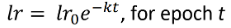     

  > epoch[对数据的一次传递(打乱或采样)]

- 还有更高级的方法，比如循环学习率 (q.v.) [帮助模型跳出大坑]

> 更高级的优化器仍然使用学习率，但它可能是优化器收缩的初始速率——因此可能能够从高开始(如0.1)

#### 6. 权重衰减(抑制过拟合)

L2正则化就是在代价函数后面再加上一个正则化项：

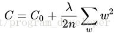 

其中C0代表原始的代价函数，后面那一项就是L2正则化项，它是这样来的：所有参数w的平方的和，除以训练集的样本大小n。λ就是正则项系数，权衡正则项与C0项的比重。另外还有一个系数1/2，1/2经常会看到，主要是为了后面求导的结果方便，后面那一项求导会产生一个2，与1/2相乘刚好凑整为1。系数λ就是权重衰减系数。

**为什么可以对权重进行衰减**
我们对加入L2正则化后的代价函数进行推导，先求导：

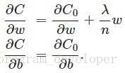 

可以发现L2正则化项对b的更新没有影响，但是对于w的更新有影响：

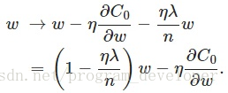 

在不使用L2正则化时，求导结果中w前系数为1，现在w前面系数为1-ηλ/n，因为η、λ、n都是正的，所以1-ηλ/n小于1，它的效果是减小w，这也就是权重衰减（weight decay）的由来。当然考虑到后面的导数项，w最终的值可能增大也可能减小。
另外，需要提一下，对于基于mini-batch的随机梯度下降，w和b更新的公式跟上面给出的有点不同：

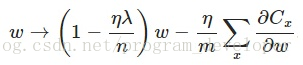 

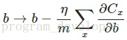 

对比上面w的更新公式，可以发现后面那一项变了，变成所有导数加和，乘以η再除以m，m是一个mini-batch中样本的个数。

**权重衰减（L2正则化）的作用**
思考： L2正则化项有让w变小的效果，但是为什么w变小可以防止过拟合呢？
原理： （1）从模型的复杂度上解释：更小的权值w，从某种意义上说，表示网络的复杂度更低，对数据的拟合更好（这个法则也叫做奥卡姆剃刀），而在实际应用中，也验证了这一点，L2正则化的效果往往好于未经正则化的效果。（2）从数学方面的解释：过拟合的时候，拟合函数的系数往往非常大，为什么？如下图所示，过拟合，就是拟合函数需要顾忌每一个点，最终形成的拟合函数波动很大。在某些很小的区间里，函数值的变化很剧烈。这就意味着函数在某些小区间里的导数值（绝对值）非常大，由于自变量值可大可小，所以只有系数足够大，才能保证导数值很大。而正则化是通过约束参数的范数使其不要太大，所以可以在一定程度上减少过拟合情况。

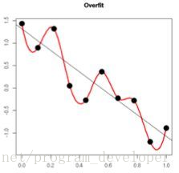 

#### 7. dropout(抑制过拟合)

Dropout，它为什么有助于防止过拟合呢？可以简单地这样解释，运用了dropout的训练过程，相当于训练了很多个只有半数隐层单元的神经网络（后面简称为“半数网络”），每一个这样的半数网络，都可以给出一个分类结果，这些结果有的是正确的，有的是错误的。随着训练的进行，大部分半数网络都可以给出正确的分类结果，那么少数的错误分类结果就不会对最终结果造成大的影响。

更加深入地理解，可以看看Hinton和Alex两牛2012的论文《ImageNet Classification with Deep Convolutional Neural Networks》

#### 8. BN & LN

https://blog.csdn.net/u010159842/article/details/109326409

#### 9. 评价指标

简要介绍精度、精确率、召回率、P-R曲线、F1 值、TPR、FPR、ROC、AUC等指标，还有在生物领域常用的敏感性、特异性指标。

- 基础

  在分类任务中，各指标的计算基础都来自于对正负样本的分类结果，用混淆矩阵表示为：

  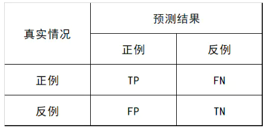   

- Accuracy 准确率

  定义：(TP+TN)/(TP+FN+FP+TN) 即所有分类正确的样本占全部样本的比例

- Precision 查准率

  定义：(TP)/(TP+FP) 即预测是正例的结果中，确实是正例的比例

- Recall 查全率

  定义：(TP)/(TP+FN) 即所有正例的样本中，被找出的比例

- PRC 

  定义：根据预测结果将预测样本排序，最有可能为正样本的在前，最不可能的在后，依次将样本预测为正样本，分别计算当前的精确率和召回率，绘制P-R曲线。

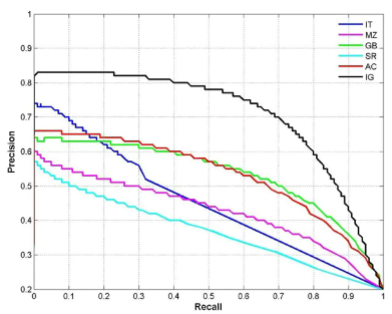  

- F1 值 定义：(2 * P * R)/(P + R)

  https://www.jianshu.com/p/ae9a0e9b58ba

  - Macro Average 在google上搜索，可以看到如下描述

    The F1 measure is widely used to evaluate the success of a binary classifier when one class is rare. Micro average, macro average, and per instance average F1 measures are used in multilabel classification.

    传统的F1计算公式[1]，只适用于二分类模型。对多分类模型来说，要用Macro Average规则来进行F1（或者P、R）的计算。

    - 举例来说，假设是三个类别的分类模型:

      y_true=[1,2,3]   y_pred=[1,1,3] 根据P/R的计算规则[1]，

      Precision = (预测为1且正确预测的样本数)/(所有预测为1的样本数) = TP/(TP+FP)
      Recall = (预测为1且正确预测的样本数)/(所有真实情况为1的样本数) = TP/(TP+FN)
      F1 = 2*(Precision*Recall)/(Precision+Recall)     若除法过程中，分子分母同时为零，则最终结果也为0.

      则Macro Average F1的计算过程如下：

      1. 将第1个类别设置为True，非第1个类别的设置为False 计算其P1,R1

         y_true=[1,0,0]  y_pred=[1,1,0]

         P1 = (预测为1且正确预测的样本数)/(所有预测为1的样本数) = TP/(TP+FP) = 1/(1+1)=0.5

         R1 = (预测为1且正确预测的样本数)/(所有真实情况为1的样本数) = TP/(TP+FN)= 1/1 = 1.0

         F1_1 = 2*(PrecisionRecall)/(Precision+Recall)=20.5*1.0/(0.5+1.0)=0.6666667

      2. 算出其他类别的P R

      3. 对P1/P2/P3取平均为P，对R1/R2/R3取平均为R，对F1_1/F1_2/F1_3取平均F1

         P=(P1+P2+P3)/3=(0.5+0.0+1.0)/3=0.5
         R=(R1+R2+R3)/3=(1.0+0.0+1.0)/3=0.6666666
         F1 = (0.6666667+0.0+1.0)/3=0.5556


- TPR 真正例率，与召回率相同 定义：(TP)/(TP+FN) 

- FPR 假正例率 定义：(FP)/(TN+FP)

- ROC 受试者工作特征

  定义：根据预测结果将预测样本排序，最有可能为正样本的在前，最不可能的在后，依次将样本预测为正样本，分别计算当前的TPR和FPR，绘制ROC曲线。

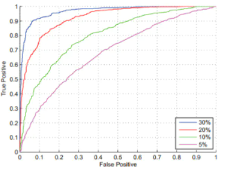   

- AUC Area Under ROC Curve 定义：ROC曲线下的面积
- sensitivity 定义：TP / (TP + FN) 即有病（阳性）人群中，检测出阳性的几率。（检测出确实有病的能力）
  - specificity 定义：TN / (TN + FP) 即无病（阴性）人群中，检测出阴性的几率。（检测出确实没病的能力）


### Suggested Readings:

#### 1. backprop的一些细节：

注意梯度消失等一些问题


## Assignment 2

#### 1.矩阵求导参考：

[Review of differential calculus](https://web.stanford.edu/class/archive/cs/cs224n/cs224n.1194/readings/review-differential-calculus.pdf)

**a2 的 gradient-notes**

##### 1.1 几点注意事项：

- 区分 微分 梯度 偏导数

  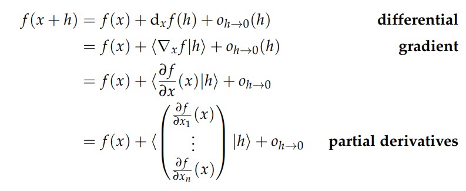  

- 注意在**Rn到R**的关系中(即只有一个输出函数/输出矩阵有一个维度为一维) Jacobian行列式与梯度之间有一个转置关系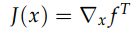 

  因为定义的时候Jacobian就是个行向量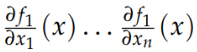   

  但是梯度被定义为列向量 所以之间有个转置的关系

  > 当有多个输出函数时(大多数情况)  两者数值上相同

- 标记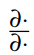符号通常是模棱两可的，可以指梯度或Jacobian行列式。


##### 1.2 几个有用的矩阵求导二级结论

(推导见a2 gradient-notes)

- 与 logits 相关的交叉熵损失 

  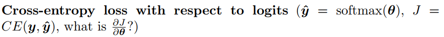  

  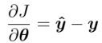    (如果为y是列向量的话 就转置一下)

      

- 矩阵求导如果没有square型的矩阵 则只有唯一的满足矩阵乘法性质的排列和转置 所以可以用这个性质去检验

#### 2. word2vec 的实现

实现了 word2vec 模型并使用随机梯度训练下降 (SGD)训练词向量。

代码详见 https://github.com/wangxidong06/CS224N/tree/master


## Lecture 5 dep-parsing

### Slides:

#### 1. 一些基本知识

参见课件

### Suggested Readings:


## Lecture 6 rnn-lm

### Slides:

#### 1. 一些基本知识

参见课件

### Suggested Readings:


## Assignment 3

#### 1. pytorch

PyTorch Tutorial Session[[colab notebook](https://colab.research.google.com/drive/1Z6K6nwbb69XfuInMx7igAp-NNVj_2xc3?usp=sharing)] [[preview](http://web.stanford.edu/class/cs224n/materials/CS224N_PyTorch_Tutorial.html)] 

#### 2. Neural Transition-Based Dependency Parsing 的实现

实现了一个基于神经网络的依赖解析器，目标是最大限度地提高 UAS（未标记附件分数）指标的性能。

代码详见https://github.com/wangxidong06/CS224N/tree/master


## Lecture 7 fancy-rnn

### Slides:

#### 1. 一些基本知识

参见课件

### Suggested Reading:


## Assignment 4

#### 1. Neural Machine Translation 的实现

实现了一个序列到序列（Seq2Seq）注意力网络，构建神经机器翻译（NMT）系统,该系统使用双向 LSTM编码器和单向 LSTM 解码器。

**BLEU** 最高为21.48

代码实现: https://github.com/wangxidong06/CS224N/blob/master/a4

#### 2. tmux的使用

https://www.ruanyifeng.com/blog/2019/10/tmux.html

#### 3. git github的使用

https://product.hubspot.com/blog/git-and-github-tutorial-for-beginners

https://www.jianshu.com/p/296d22275cdd


## Lecture 8 	Final Projects Practical Tips

#### 1. 寻找研究课题

##### 1.1 两个基本出发点：

- [钉子] 从感兴趣的（领域）问题开始，并尝试找到好的/更好的方法解决它比目前已知/使用的
- [锤子] 从感兴趣的技术方法/方法开始，并制定出好的扩展或改进它的方法或应用它的新方法

##### 1.2 寻找有趣的起点：

- 查看NLP 论文的 ACL 选集：
  https://www.aclweb.org/anthology/

- 查看主要 ML 会议的在线会议记录：

  NeurIPS https://papers.nips.cc, ICML, ICLR

- 尝试在以下位置进行关键字搜索：

  - http://arxiv.org/
  - http://scholar.google.com
  - http://dl.acm.org/
  - http://aclasb.dfki.de/

**[Mark]更好的是：在世界上寻找一个有趣的问题！**
Hal Varian: How to Build an Economic Model in Your Spare Time
**https://people.ischool.berkeley.edu/~hal/Papers/how.pdf**  


##### 2. NLP 2021  令人兴奋的领域

现在很多令人兴奋的是在这个世界内部或世界范围内起作用的问题:

- 评估和改进模型的准确性以外的其他方面

  - 域转移的稳健性
  - 总体上评估模型的稳健性：https://robustnessgym.com

- 做实证工作，看看大型预训练模型学到了什么

- 研究如何从大型模型中为没有大量数据（迁移学习等）的特定任务获取知识和良好的任务性能

- 查看大型模型的偏差、可信度和可解释性

- 研究如何增加模型的数据以提高性能

- 低资源语言

- 提高稀有事物的尾部性能

- 放大和缩小模型

  - 构建大模型很重要: GPT-2 and GPT-3 … but just not possible for a cs224nproject  
  - 构建小型、高性能的模型也很重要。 这可能是一个很棒的项目
    - 模型修剪，例如：https://papers.nips.cc/paper/2020/file/eae15aabaa768ae4a5993a8a4f4fa6e4-Paper.pdf
    - 模型量化，例如：https://arxiv.org/pdf/2004.07320.pdf
    - 在 6GB 或 500MB 中的 QA 能力如何？ https://efficientqa.github.io

- 希望实现更高级的功能

  例如，组合性、系统概括、快速学习（例如元学习）处理较小的问题和数据量，并且速度更快

  - BabyAI：https://arxiv.org/abs/2007.12770
  - gSCAN：https://arxiv.org/abs/2003.05161


#### 3.查找数据集和任务：

网络上有许多公开可用的数据集。以下是一些用于查找数据集的有用资源：

- 用于跟踪 NLP 进度的存储库，包括数据集列表和最常见 NLP 任务的当前最先进性能。
  https://nlpprogress.com/

- 用于常见 NLP 任务的一小部分众所周知的标准数据集：
  https://machinelearningmastery.com/datasets-natural-language-processing/

- 免费或公共领域文本数据集的字母顺序列表：
  https://github.com/niderhoff/nlp-datasets

- 维基百科有一个机器学习文本数据集列表，其中列出了有用的信息，例如数据集大小。
  https://en.wikipedia.org/wiki/List_of_datasets_for_machine_learning_research#Text_data

- Kaggle 有很多数据集，尽管其中一些对于深度学习来说太小了。尝试搜索“nlp”。
  https://www.kaggle.com/datasets

- Datahub 有很多数据集，但并非所有数据集都专注于机器学习。
  https://datahub.io/collections

- Microsoft Research 有一组数据集（在“数据集目录”选项卡下查看）：
  http://research.microsoft.com/en-US/projects/data-science-initiative/datasets.aspx

- 用于在 arXiv 论文中搜索关键字并提取重要信息（例如任务的性能指标）的脚本。

  https://huyenchip.com/2018/10/04/sotawhat.html

- 指向更多数据集链接集合的链接集合！
  http://kevinchai.net/datasets

- 包含许多 NLP 任务代码的论文集。
  https://paperswithcode.com/sota

- 用于机器翻译的数据集。
  http://statmt.org

- 许多语言的句法语料库。
  https://universaldependencies.org


#### 4. Research habits/tricks/pipeline: 

Hal Varian: How to Build an Economic Model in Your Spare Time 

**https://people.ischool.berkeley.edu/~hal/Papers/how.pdf**  

##### 4.1 寻找研究课题：

通过实践 沟通 交流  在世界上寻找一个领域相关的有趣的问题！ 这比读文献效果更好 内驱力更足

##### 4.2  动手实验尝试：

在进行系统广泛的文献检索之前，先对自己的想法进行几周的实验和研究，这样效果更好，即便可能已经有人做过

##### 4.3 简化泛化模型：

有了模型之后  [简化以获得结果，复杂化以查看它的通用性  来回反复] 

- **简化**模型 不要着急证明数学 先拿一些简单的示例运行 看看有什么共同点 有趣点 可以继续简化模型到不能再简化

- **泛化**得到的模型或结果 因为这很可能是某个成熟体系的一个特例 所以可以借助那个体系下所有的分析工具或特性进行丰富

  最终看到事情的简单核心，了解这种现象到底有多普遍。


##### 4.4 和导师交流 进行文献系统阅读

- 大概率会在权威书籍上并找到“你的”模型——但它会做得更好、更完善、更清晰 仔细阅读文章并问自己“我为什么不这样做？” 如果有人开始和你有同样的想法，然后进一步发展，你想看看你错过了什么。

- 另一方面，如果你真的遵循上面的建议以保持简单，你可能会想出比目前的治疗方法更清晰的东西。或者，也许你发现了一些更普遍的东西。如果是这样，你可能会有一个有价值的见解。回去告诉导师并告诉他或她你的发现。也许你对一个值得进一步探索的旧想法有了新的看法。如果是这样，恭喜 - 如果您立即进行文献检索，您将永远不会找到这个。

- 也许你发现的东西还没有出现在文献中 那可能是你错了 这是您的导师可以发挥重要作用的地方

  常见问题是你离工作太近了，无法真正了解正在发生的事情 这种缺乏远见有两种形式之一

  

  - 首先，你可能认为某些事情是显而易见的，而实际上并非如此。这对您来说可能很明显，但您已经考虑这个问题几个月了——对于没有从这种经历中受益的人来说，这可能并不那么明显。

  - 另一种可能性是，当某件事情非常明显时，您可能会认为它很复杂——您已经通过一条蜿蜒的小路漫步到了森林中。也许在几英尺远的地方有一条很清晰的小径，而您却完全错过了

    所以在这一点上，你必须开始对你的工作进行一些独立的判断。和你的导师谈谈，和你的同学谈谈，和你的妻子、丈夫、女朋友、男朋友、邻居或宠物谈谈。 这就是你会发现的：他们不知道你在说什么（尤其是你的宠物）。所以你必须回到试图弄清楚你真正在谈论什么：你的模型的基本思想是什么？

 ##### 4.5 参加研讨会 演讲

- 不要认为只是因为自己在论文中投入了大量工作和大量思考 世界其他地方有义务关注自己。现代世界的根本稀缺是注意力的稀缺。每个人都有关注的需求，如果你想让别人关注你，你必须给他们一个这样做的理由。研讨会是让他们关注的一种方式，所以一定要利用这个机会让人们听你的。

研讨会分为三个部分：引言、内容和结论

###### 4.5.1 引言：

- 建议很简单：没有自我介绍。许多研讨会被冗长、自命不凡、毫无内容的介绍毁了。只需说几句关于大局的句子，然后进入正题：向他们展示你所拥有的以及为什么它很重要。[一张或两张幻灯片中作为介绍]

###### 4.5.2 内容：

在你的演讲中有两件事要避免：不要让你的听众睡着，不要让他们太活跃。

- 演讲前几个slide抓住他们的注意力 你只有20min(如果幸运的话)

- 所以不要放松对研讨会的控制！保持控制的关键是尽早建立可信度。这方法是在展示你的第一个结果时非常详细——一个定理、一个回归、一个图表，等等。详细说明结果的每个方面，以免引起任何人的误解。

  [当你这样做时，你肯定会得到这样的问题：“这会推广到 nagents 吗？”或者“你有没有纠正异方差？”如果您知道问题的答案，请继续回答。如果你不知道答案——或者问题完全不合时宜——说“这是个好问题；让我在研讨会结束时再说一遍。"]

- 一旦你展示了你的结果并且你看到观众已经理解了这一点——他们的头是点头但不是点头——你可以继续进行概括和阐述。

  如果您最初在建立信誉方面做得很好，那么听众会相信您说的任何话！当然你不应该滥用这种信任，但它很有用在演示文稿的其余部分中利用它。这就是开始简单的根本原因：如果你从一个微妙的论点开始，听众很难理解，你永远无法建立信任。

###### 4.5.3 结论：

- 我总是喜欢在最后几分钟总结我的成就以及观众为什么应该关心。毕竟，这就是他们会离开的东西，所以你不妨告诉他们应该记住什么，而不是让他们自己弄清楚。[一张幻灯片作为结论]

###### 4.5.4 结束：

- 演讲结束后，您应该花几分钟记下一些笔记：人们难以理解的是什么？他们问了什么问题？他们提出了什么建议？他们给了你什么参考？你可能认为你会记住这些要点，但很多时候你不会。听众是澄清想法的非常有用的资源——确保你使用得当。


##### 4.6 规划论文：

1. 我的计算机上有一个名为 Papers 的目录，当我开始研究一个新主题时，我会在 Papers 下创建一个子目录。 （例如，这篇论文在目录 Papers/how-Iwork 中。）当我创建目录时，我创建了一个 notes.txt 文件：它包含我的初步想法、粗略的大纲等等。例如，本文的 notes.txt 文件最初包含如下条目：
   *看报纸
   *简化
   *写和说
   **如果你不在第一页抓住它们，他们就不会阅读

   当我第一次开始研究一个主题时，我会创建一个这样的笔记文件——我记下我最初的想法，这些想法通常很粗略。

2. 在接下来的几天和几周里，我偶尔会看看这个大纲。当我看着它时，我会四处移动东西，添加材料等等。我很少完全取出任何东西——我只是将材料移到文件的末尾。毕竟，我可能会再次想要那些笔记。

3. 在将这些想法组织了几个星期或几个月之后，我准备写论文的初稿。**我通常会尝试在一两天内完成此操作，以保持新鲜感**。

   [我常把笔记放在一个窗口和纸上 在另一个中写论文，而我回顾并更新笔记以保持它们与论文同步]

4. 论文写好后，我把它放在一边几个星期。让潜意识有机会处理这个想法——也许它会想出你的意识错过的东西。当回到论文上时，我尝试以全新的心态阅读它，就像以前从未见过它的人一样。

   在极少数情况下，我喜欢我阅读的内容，但通常我会受到很多批评。每当我不得不停下来思考“这是什么意思？”我重写——我添加更多的解释，改变符号，或者任何使论文更清晰的必要条件。当我完成这个过程时，我就有了初稿。

5. 接下来将这个草案放入版本控制环境下 然后重复这个过程：让论文再等几个星期或几个月，然后再回来，以全新的心态阅读并相应地修改它。在您举办研讨会后立即进行修订特别有用。还记得我让你在研讨会结束后写的那些笔记吗？坐下来看论文，回顾一下听众提出的问题和他们提出的建议。你能在论文中回答他们的问题吗？你能采纳他们的建议吗？当你吸收听众的建议时，一定要修改你的演讲的笔记/大纲/幻灯片。


##### 4.7 论文结构

- 引言是论文中最重要的部分。你必须在第一页上抓住读者。不管这篇论文的其余部分多么精彩，如果没有人阅读它也不会被注意到。如果您对前几段不感兴趣，没有人会阅读它。

- 如果你真的知道你的论文是关于什么的，你应该不难用几段话向你的读者解释这一点。我的基本建议是让你的论文看起来像你的演讲。切入正题。使用示例。把事情简单化。在你完成之后告诉人们为什么你所做的很重要。把繁琐的东西放在附录中。

- 最后总结一下你所取得的成就。

  如果你真的写了一篇好论文，人们就不必听你的研讨会来了解你做了什么：他们可以在你的论文中阅读它。

  

##### 4.8 何时停止

- 您可以通过研讨会上的反应来判断您的作品何时准备好发表：人们不再提问。 （或者至少，读过你论文的人不再提问。）如果你听从了我的建议，你已经在你的论文中提出了他们的问题并回答了他们。
- 一旦你提出了你的观点，就停下来。很多论文拖得太久了。我之前说过，人们只记得你研讨会的大约 20 分钟（如果你幸运的话），**他们只记得你的论文的大约 10 页。你应该能够在那个长度内说出你想说的大部分内容。**
- 写完论文后，您可以将其提交。**在将文章发送之前，您应该用细齿梳仔细检查文章。没有什么比在他们处理的文章中发现错别字、缺少参考文献和草率编辑更让编辑或审稿人失望的了**。


####  5.  项目建议

##### 5.1 定义你的目标

在您的项目开始时，在您的脑海中明确定义您的目标并确保您团队中的每个人都理解这些目标非常重要。特别是：

- 明确定义任务。什么是输入，什么是输出？能给我举个例子吗？如果任务不能被定义为输入和输出，那么你到底想实现什么？
- 您将使用什么数据集？该数据集是否已经组织到上述输入和输出部分中？如果没有，您打算如何以您需要的格式获取数据？
- 您的评估指标（或指标）是什么？这需要是一个定义明确的数字度量（例如 ROUGE 分数），而不是一个模糊的概念（例如“摘要质量”）。有关如何评估您的方法的更多详细信息，参见5.6。
- 您的项目的成功是什么样的？对于您选择的评估指标，根据之前的研究，哪些数字代表了预期绩效？如果您正在进行分析或理论项目，请定义您的假设并弄清楚您的实验将如何确认或否定您的假设。

##### 5.2 处理数据

您可能需要对数据进行（额外）处理（例如标记化、标记或解析）。 以下是一些可能有用的工具：

- StanfordNLP（新！）：一个提供标记化、标记、解析和其他功能的 Python 库。 涵盖 53 种语言。 https://stanfordnlp.github.io/stanfordnlp/
- 斯坦福 NLP 小组的其他软件：
  http://nlp.stanford.edu/software/index.shtml
- NLTK，Python 中的轻量级自然语言工具包：
  http://nltk.org/
- spaCy，另一个可以进行预处理的 Python 包，但也包括神经模型（例如语言模型）：
  https://spacy.io/

##### 5.3 数据hygiene

在项目开始时，将数据集拆分为训练数据（大部分数据）、开发数据（也称为验证数据）和测试数据。典型的训练/开发/测试分割可能是 90/5/5%（随机分配）。许多 NLP 数据集都带有预定义的分割，如果您想与同一数据集上的现有工作进行比较，您应该使用与该工作中使用的相同的分割。以下是您应该如何在项目中使用这些数据拆分：

1. 训练数据：使用这个（并且只使用这个数据！）来优化你的神经模型的参数。
2. 开发数据：这有两个主要用途。第一个是通过计算开发数据的评估指标来比较不同模型（或相同模型的版本）的性能。这使您能够选择应在测试数据上评估的最佳超参数和/或架构选择。开发数据的第二个重要用途是决定何时停止训练模型。决定何时停止训练的两种简单而常用的方法是：
   (a) 每个 epoch（或每 N 次训练迭代，其中 N 是预定义的），记录当前模型在开发集上的性能并将当前模型存储为检查点。如果开发性能比上一次迭代差（或者，如果它连续 M 次未能超过最佳性能，其中 M 是预定义的），则停止训练并保留最佳检查点。
   (b) 训练 E epochs（其中 E 是某个预定义的数字），并且在每个 epoch 之后，记录当前模型在开发集上的性能并将当前模型存储为检查点。一旦 E epochs 结束，停止训练并保留最佳检查点。
3. 测试数据：在项目结束时，根据测试数据评估经过最佳训练的模型，以计算最终性能指标。从科学上讲，你应该只使用训练数据和开发数据

我们使用数据拆分的原因是为了避免过度拟合。如果您只是选择在训练集上表现最好的模型，那么您将不知道您的模型在新数据样本上的表现如何——您会过度拟合训练集。在 NLP 中，强大的神经模型特别容易对其训练数据过度拟合，因此这一点尤为重要。

同样，如果您在选择最终架构和超参数之前查看测试集，这可能会影响您的决策并导致您的项目过度拟合测试数据。因此，为了科学的利益，在项目结束之前不要接触测试集是非常重要的。这将确保您报告的定量性能将是对您的方法将如何处理新数据样本的诚实无偏估计。

甚至可能过度拟合开发集。如果我们训练许多不同的模型变体，并且只保留在开发集上表现最好的超参数和架构，那么我们可能会过度拟合开发集。**要解决此问题，您甚至可以使用两个单独的开发集（其中一个称为调整集，另一个称为开发集）。调整集用于优化超参数，开发集用于测量整体进度。如果您对超参数进行了大量优化并进行了多次迭代，您甚至可能希望创建多个不同的开发集（dev、dev2、...）以避免过度拟合。**


##### 5.4 建立强大的基线

基线是一种比较复杂的神经系统的更简单的方法。基线很重要，这样我们才能在上下文中了解系统的性能。

例如，假设您正在构建一个基于 LSTM 的多层网络，并专注于进行二元情感分析（将句子分类为正面或负面）。最简单的基线是猜测基线，它可以达到 50% 的准确率（假设数据集是 50% 的正数和 50% 的负数）。更复杂的基线是简单的非神经机器学习算法，例如朴素贝叶斯分类器。你也可以有简单的神经基线，例如，使用平均词嵌入对句子进行编码。最后，您应该与完整模型的更简单版本进行比较，例如普通 RNN 版本、单层版本或无需注意力的版本。

最后几个选项也称为消融实验。 消融实验移除了完整模型的某些部分并测量了性能——这有助于量化网络的不同部分对性能的帮助程度。 消融实验是分析模型的绝佳方式。

**建立强大的基线非常重要。 研究人员和从业者常常陷入制定太弱基线或根本无法定义任何基线的陷阱。 在这种情况下，我们根本无法判断复杂的神经系统是否增加了任何价值。 有时，强基线的表现比您预期的要好得多，这一点很重要。**


##### 5.5 训练和调试神经模型

不幸的是，众所周知，神经网络难以调试。但是，这里有一些提示：

- 要调试神经模型，请在小型玩具数据集（例如，一小部分训练数据或手工创建的玩具数据集）上进行训练以进行完整性检查和诊断错误。例如，如果您的模型无法在这个玩具数据集上过拟合（例如实现接近零的训练损失），那么您的实现中可能存在错误。
- 超参数（例如学习率、层数、辍学率等）通常会显著影响结果。使用开发集的性能来调整这些参数。尽管您可能没有时间进行非常详尽的超参数搜索，但请尝试识别最敏感/最重要的超参数并对其进行调整。
- 由于它们的强大，神经网络很容易过拟合。基于开发集的正则化（dropout、权重衰减）和停止标准（例如提前停止，参阅第 5.3）对于确保您的模型在新的看不见的数据样本上表现良好非常重要。
- 一个更复杂的神经模型可能会“默默地失败”：当真正有趣的组件（例如一个很酷的注意力机制）由于错误而失败时，它可能会通过依赖简单的部分获得不错的性能。使用消融实验（参见5.4 ）来诊断模型的不同部分是否正在增加价值。
- 在训练过程中，随机化训练样本的顺序，或者至少去除明显的排序（例如，不要通过按照句子长度的顺序遍历语料库来训练你的 Seq2Seq 系统数据——相反，确保后续小批量中的句子不相关）。 SGD 依赖于样本以随机顺序出现的假设。
- 有许多在线资源包含构建神经网络模型的实用建议。**请注意，大多数此类建议更多地基于个人经验而不是严格的理论，并且这些想法会随着时间的推移而发展 - 所以请谨慎对待！毕竟，您的项目可以通过反驳一些普遍持有的信念来开辟新的视角。**
  - 关于最常见的神经网络错误的 Twitter 帖子（2018 年 6 月）：
    https://twitter.com/karpathy/status/1013244313327681536
  - 深度学习 NLP 最佳实践博客文章（2017 年 7 月）：
    http://ruder.io/deep-learning-nlp-best-practices/
  - 构建深度神经网络的实用建议（2017 年 10 月）：
    https://pcc.cs.byu.edu/2017/10/02/practical-advice-for-building-deep-neural-networks/


##### 5.6 评价

项目中，进行有意义的评估与设计和构建神经模型一样重要。有意义的评估意味着您应该使用适当的评估指标仔细比较您的方法的性能。

- 选择评估指标

  您必须至少有一个评估指标（它应该是一个可以自动计算的数字指标）来衡量您的方法的性能。如果在同一数据集和/或任务上已有已发布的工作，您应该使用与该工作相同的指标（尽管如果您认为它有用，您可以评估其他指标）。

- 人工评估 

  在缺乏良好、全面的自动评估指标的研究领域（例如一些自然语言生成任务），人工评估通常是必要的。如果您想使用人工判断作为评估指标，欢迎您这样做（尽管您可能会发现很难找到时间和/或资金来收集许多人工评估）。收集少量人工判断可能是您项目的宝贵补充，但您必须至少有一个自动评估指标——即使它是一个不完美的指标。

- 比较什么

  您应该使用评估指标来 

  - 将您的模型与之前的工作进行比较

  - 将您的模型与您的基线进行比较（参见5.4)

  - 比较模型的不同版本

  在与之前的工作进行比较时，请确保获得正确的细节——例如，之前的工作是否以区分大小写或不区分大小写的方式计算 BLEU 指标？如果你计算你的评估指标与以前的工作不同，这些数字就没有可比性！

- 定性评估 

  到目前为止，本节讨论了定量评估——数值性能测量。定性评估或分析旨在通过测量或检查模型的关键特征或输出来了解您的系统（它如何工作、何时成功以及何时失败）。您需要在最终报告中包含一些定性评估。以下是一些类型的定性评估：

  - 一种简单的定性评估是在报告中包含一些示例（例如输入和模型输出）。但是，不要只提供没有评论的随机示例——找到支持您论文整体论点的有趣示例，并对其进行评论。 
  - 错误分析是另一种重要的定性评估类型。尝试识别错误类别。
  - 按某些标准细分性能指标。例如，如果您认为翻译模型在翻译长句方面特别糟糕，请通过将 BLEU 分数绘制为源句长度的函数来表明这一点。
  - 比较两个系统在单个评估指标数之外的性能。例如，您的模型在哪些示例中正确而基线错误，反之亦然？这些例子可以用一些质量来表征吗？如果是这样，请通过测量或绘制质量来证实该声明。
  - 如果您的模型使用注意力，您可以创建注意力分布的图或可视化，以查看模型在特定示例上的注意事项。

  **如果您的方法成功，定性评估对于了解数字背后的原因和确定需要改进的领域很重要。如果您的方法不成功，定性评估对于了解哪里出了问题更为重要。**


## Project Proposal

## Lecture 9 transformers

#### 1. 一些基本知识

### Suggested Reading:

## Lecture 10 pretraining

#### 1. 一些基本知识

### Suggested Reading:

## Assignment 5 

#### 1. [多元高斯分布（The Multivariate normal distribution）](https://www.cnblogs.com/bingjianing/p/9117330.html)

#### 2. single-headed attention 的缺点:  

**直观地说 尽管单头注意力可以抵抗键中的小扰动，但某些类型的较大扰动可能会带来更大的问题。** 

#### 3. multi-headed attention 的作用:

**直观地说 多头注意力可以抵抗键中的较大扰动 并且可以并行计算** 

#### 4.  K-Q-V的真正作用：

**直观地说，KQV允许网络选择 xi 的不同方面作为“内容”（值向量），而不是它用来确定“在哪里查找”内容（键和查询）的内容。** 
